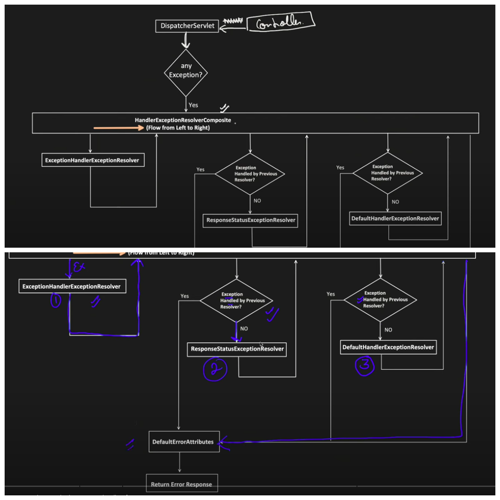

# Exception Handling in Spring

This package demonstrates different approaches to exception handling in Spring Framework, including controller-specific exception handling, global exception handling, and using @ResponseStatus annotation.

## Key Concepts Demonstrated

### Exception Handling Mechanisms
The package demonstrates the main exception resolvers in Spring:

#### ExceptionHandlerExceptionResolver
- Handles exceptions using `@ExceptionHandler` methods in controllers or `@ControllerAdvice` classes
- Provides the most flexibility for custom error responses
- Allows handling multiple exception types with a single method
- Can return different response types (ResponseEntity, ModelAndView, etc.)
- Processes exceptions in this order:
  1. Controller-specific `@ExceptionHandler` methods
  2. Global `@ControllerAdvice` handlers

#### ResponseStatusExceptionResolver
- Handles exceptions annotated with `@ResponseStatus`
- Automatically maps exceptions to HTTP status codes
- Simplifies exception handling for straightforward cases
- No need to write explicit handler methods

#### DefaultHandlerExceptionResolver
- Handles standard Spring exceptions (e.g., NoSuchRequestHandlingMethodException)
- Maps them to appropriate HTTP status codes
- Acts as a fallback for Spring's internal exceptions

#### DefaultErrorAttributes
- Creates default error responses when other resolvers don't handle the exception
- Used when an exception handler doesn't return a ResponseEntity
- Provides a consistent error response format

### Controller-Specific Exception Handling
The `correctWayToHandlePerControllerException` subpackage demonstrates:
- Using `@ExceptionHandler` annotation within a controller to handle specific exceptions
- Different ways to return error responses:
  - Returning ResponseEntity with custom error details
  - Using HttpServletResponse to send error status and message

```java
@RestController
public class TestExceptionHandlingController1 {
    @GetMapping("v2/user")
    public String getUserV2() {
        throw new CustomException(HttpStatus.BAD_REQUEST, "An error occurred while fetching user data.");
    }

    @ExceptionHandler({CustomException.class, IllegalArgumentException.class})
    public ResponseEntity<Object> handleCustomExceptions(Exception ex) {
        return ResponseEntity.status(HttpStatus.BAD_REQUEST)
                .body(new ErrorResponse(now(), ex.getMessage(), HttpStatus.BAD_REQUEST.value()));
    }
}
```

### Global Exception Handling
The `globalExceptionHandler` subpackage demonstrates:
- Using `@ControllerAdvice` to create a global exception handler
- Handling exceptions across multiple controllers
- Providing consistent error responses throughout the application

```java
@ControllerAdvice
public class GlobalExceptionHandling {
    @ExceptionHandler({CustomException.class, IllegalArgumentException.class})
    public ResponseEntity<Object> handleCustomExceptions(Exception ex) {
        return ResponseEntity.status(HttpStatus.BAD_REQUEST)
                .body(new ErrorResponse(now(), ex.getMessage(), HttpStatus.BAD_REQUEST.value()));
    }
}
```

### @ResponseStatus Annotation
The `ResponseStatusExceptionResolver` subpackage demonstrates:
- Annotating exception classes with `@ResponseStatus` to automatically map them to HTTP status codes
- Simplifying exception handling by letting Spring automatically handle the response

```java
@ResponseStatus(value = HttpStatus.INTERNAL_SERVER_ERROR, reason = "An error occurred while processing the request.")
public class CustomException1 extends RuntimeException {
    // Exception implementation
}
```

### Common Anti-Patterns
The `incorrectWayToHandleException` subpackage demonstrates:
- Anti-patterns in exception handling, such as:
  - Catching exceptions in controller methods with try-catch blocks
  - Manually creating error responses in each controller method
  - Inconsistent error response formats

## Exception Handling Flow in Spring

1. When an exception is thrown in a controller method, Spring's DispatcherServlet delegates to its configured exception resolvers
2. Spring tries to find an `@ExceptionHandler` method in the same controller
3. If not found, it looks for a matching handler in any `@ControllerAdvice` classes
4. If the exception is annotated with `@ResponseStatus`, ResponseStatusExceptionResolver handles it
5. If no handler is found, the exception propagates to the container

### Detailed Exception Resolution Process

The exception handling process in Spring involves several components working together:

1. **ExceptionHandlerExceptionResolver**: This resolver handles exceptions using methods annotated with `@ExceptionHandler` in controllers or classes annotated with `@ControllerAdvice`.

2. **ResponseStatusExceptionResolver**: This resolver handles exceptions annotated with `@ResponseStatus`.

3. **DefaultHandlerExceptionResolver**: This resolver handles standard Spring exceptions and converts them to appropriate HTTP status codes.

4. **DefaultErrorAttributes**: When an exception is not handled by any of the above resolvers, or when a handler doesn't return a ResponseEntity, DefaultErrorAttributes creates a default error response.

#### Response Generation Process

When an exception occurs, the following process determines the response:

1. **ResponseEntity Return Type**:
   - If the exception handler returns a `ResponseEntity`, it is used directly as the response
   - The Exception Resolver will not call DefaultErrorAttributes in this case
   - This gives you full control over the response status, headers, and body
   - Example:
     ```java
     @ExceptionHandler(CustomException.class)
     public ResponseEntity<Object> handleCustomException(CustomException ex) {
         return ResponseEntity.status(HttpStatus.BAD_REQUEST)
                 .body(new ErrorResponse(now(), ex.getMessage(), HttpStatus.BAD_REQUEST.value()));
     }
     ```

2. **HttpServletResponse Manipulation**:
   - If the exception handler doesn't return a `ResponseEntity` but uses `HttpServletResponse.sendError()`
   - DefaultErrorAttributes will handle creating the response based on the error status and message
   - Example:
     ```java
     @ExceptionHandler(NullPointerException.class)
     public void handleNullPointerException(HttpServletResponse response, NullPointerException ex) throws IOException {
         response.sendError(HttpStatus.BAD_REQUEST.value(), ex.getMessage());
     }
     ```

3. **Direct Exception Propagation**:
   - If an exception is thrown directly from a controller method without being caught
   - The Exception Resolver will create a ResponseEntity with appropriate status and message
   - Example:
     ```java
     @GetMapping("/user")
     public String getUser() {
         throw new CustomException(HttpStatus.BAD_REQUEST, "An error occurred while fetching user data.");
     }
     ```

4. **Anti-Pattern: Try-Catch in Controllers**:
   - Catching exceptions in controller methods with try-catch blocks is considered an anti-pattern
   - It leads to inconsistent error handling and duplicated code
   - Example of what to avoid:
     ```java
     @GetMapping("/user")
     public ResponseEntity<?> getUser() {
         try {
             // Business logic that might throw an exception
         } catch (CustomException e) {
             return ResponseEntity.status(e.getStatusCode())
                     .body(new ErrorResponse(now(), e.getMessage(), e.getStatusCode().value()));
         }
     }
     ```

#### Exception Handler Lookup Order

The order in which Spring looks for exception handlers is important:

1. First, it looks for an `@ExceptionHandler` method in the same controller where the exception occurred.

2. If not found, it looks for a matching handler in any `@ControllerAdvice` classes.

3. If still not found, it checks if the exception is annotated with `@ResponseStatus`.

4. If none of the above resolvers can handle the exception, it falls back to the default error handling mechanism.

### Exception Handling Diagram



The `exceptionHandling.png` image in this package illustrates the complete exception handling flow in Spring, showing:

1. **The Exception Resolution Chain**: How exceptions flow through different resolvers
2. **Component Interactions**: How DispatcherServlet, exception resolvers, and error attributes interact
3. **Decision Points**: The decision-making process that determines which resolver handles an exception
4. **Response Generation**: How different types of responses are generated based on the exception and handler

This visual representation helps understand the complex exception handling mechanism in Spring and how different components work together to provide a consistent error handling experience.

## Best Practices

1. **Use @ControllerAdvice for Global Exception Handling**: Create a centralized exception handling component
2. **Create Custom Exception Classes**: Define domain-specific exceptions that extend RuntimeException
3. **Use @ResponseStatus for Simple Cases**: For straightforward mappings between exceptions and HTTP status codes
4. **Return Consistent Error Responses**: Define a standard error response format
5. **Include Relevant Information**: Error responses should include timestamp, message, status code, and potentially a path
6. **Log Exceptions Appropriately**: Log exceptions with appropriate severity levels
7. **Handle Different Exception Types Differently**: Map different exceptions to appropriate HTTP status codes
8. **Don't Expose Sensitive Information**: Sanitize error messages before returning them to clients
9. **Consider Internationalization**: Support localized error messages
10. **Test Exception Handling**: Write tests specifically for exception scenarios

## Common Use Cases

1. **Validation Errors**: Handling invalid input data
2. **Resource Not Found**: Handling requests for non-existent resources
3. **Authorization Failures**: Handling unauthorized access attempts
4. **Business Rule Violations**: Handling violations of business rules
5. **External Service Failures**: Handling failures in external service calls
6. **Data Integrity Issues**: Handling database constraints or integrity violations

## Related Resources
- [Spring Exception Handling Documentation](https://docs.spring.io/spring-framework/docs/current/reference/html/web.html#mvc-ann-exceptionhandler)
- [Guide to @ExceptionHandler in Spring](https://www.baeldung.com/exception-handling-for-rest-with-spring)
- [Error Handling for REST with Spring](https://www.baeldung.com/exception-handling-for-rest-with-spring)
- [Spring Boot Error Handling](https://www.baeldung.com/spring-boot-error-handling)
