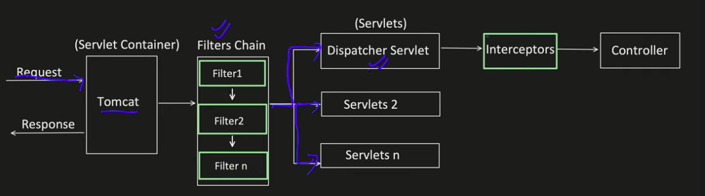

# Interceptors and Filters in Spring

This package demonstrates the implementation and usage of interceptors and filters in Spring Framework, which are powerful mechanisms for processing requests and responses at different points in the request handling lifecycle.

## Architectural Overview

The `FiltersAndInterceptors.png` image provides a comprehensive architectural diagram of how filters, interceptors, and aspect-based interceptors fit into the Spring request processing pipeline. This layered architecture allows for different types of cross-cutting concerns to be addressed at the appropriate level:

1. **Servlet Filters**: For container-level concerns like authentication, CORS, character encoding
2. **Handler Interceptors**: For Spring MVC concerns like localization, theme selection, request validation
3. **Aspect-Based Interceptors**: For method-level concerns like security, caching, logging

Each layer has different capabilities, limitations, and use cases, as detailed in the sections below.



## Key Concepts Demonstrated

### Servlet Filters
The `customFilters` subpackage demonstrates:
- Creating custom filters by implementing the `jakarta.servlet.Filter` interface
- Registering filters with specific URL patterns and execution order
- Filter lifecycle methods: init(), doFilter(), and destroy()
- Filter chaining and execution order

### Spring Interceptors
The `customInterceptor` subpackage demonstrates:
- Creating custom interceptors by implementing the `HandlerInterceptor` interface
- Registering interceptors with specific path patterns and exclusions
- Interceptor lifecycle methods: preHandle(), postHandle(), and afterCompletion()
- Interceptor execution order

### Custom Annotations with Interceptors
The `customAnnotation` subpackage demonstrates:
- Creating custom annotations with various attribute types
- Implementing aspect-based interceptors that target methods with specific annotations
- Accessing annotation attributes at runtime
- Using custom annotations to control method behavior

#### How Aspect-Based Interception Works

1. **Regular Interceptors** are applied at the URL/controller level and intercept HTTP requests
2. **Aspect-Based Interceptors** are applied at the method level and intercept method calls

Aspect-based interception using custom annotations works through Spring AOP (Aspect-Oriented Programming):

1. **Define a Custom Annotation**:
   - Create an annotation with `@Target` to specify where it can be used (methods, classes, etc.)
   - Set `@Retention` to `RetentionPolicy.RUNTIME` so it's available at runtime
   - Define attributes with default values as needed

2. **Create an Aspect**:
   - Use `@Aspect` to define a class as an aspect
   - Use `@Component` to make it a Spring-managed bean
   - Define pointcuts using `@Around`, `@Before`, `@After`, etc. with annotation-based selectors

3. **Apply the Annotation**:
   - Annotate methods with your custom annotation
   - Set attribute values as needed

4. **Execution Flow**:
   - When an annotated method is called, the aspect intercepts the call
   - The aspect can access the annotation's attributes
   - The aspect can execute code before and after the method call
   - The aspect can modify the method's arguments and return value
   - The aspect can handle exceptions thrown by the method

#### Benefits of Annotation-Based Interception

1. **Fine-Grained Control**: Apply interception at the method level rather than the controller level
2. **Declarative Approach**: Use annotations to declare behavior rather than writing code
3. **Reusability**: Create reusable aspects that can be applied to any method
4. **Separation of Concerns**: Keep cross-cutting concerns separate from business logic
5. **Metadata-Driven Behavior**: Use annotation attributes to control behavior

## Filters vs Interceptors: Key Differences

### Architectural Placement

#### Filters
- Part of the Servlet API (not Spring-specific)
- Execute at the Servlet Container level, outside the Spring context
- Execute before the DispatcherServlet processes the request
- Form a chain around the entire Spring MVC framework
- Operate on raw ServletRequest and ServletResponse objects

#### Interceptors
- Part of the Spring MVC framework
- Execute within the Spring context, after the DispatcherServlet receives the request
- Form a chain around the handler (controller) execution
- Operate on HttpServletRequest/Response and have access to the handler and ModelAndView

### Capabilities and Limitations

#### Filters
- Can modify both the request and response objects (headers, parameters, body, etc.)
- Can transform the request and response (e.g., compression, encryption)
- Can prevent the request from reaching the DispatcherServlet by not calling `chain.doFilter()`
- Applied to all requests matching URL patterns, regardless of which controller handles them
- No access to Spring's handler execution chain or model-view objects
- Cannot differentiate between requests to controllers and static resources

#### Interceptors
- Cannot modify the request and response objects but can add attributes
- Can access and modify the ModelAndView object returned by controllers
- Can prevent the handler (controller) from being executed by returning `false` from `preHandle()`
- More integrated with Spring's request processing lifecycle
- Access to Spring's handler execution chain and model-view objects
- Can be applied selectively to specific controllers or request paths
- Can access handler metadata (which controller and method will handle the request)

### Registration and Configuration

#### Filters
- Registered using `FilterRegistrationBean` in a `@Configuration` class
- Can be ordered using the `setOrder()` method
- URL patterns are specified using Ant-style patterns
- Can be registered in web.xml (traditional) or programmatically (modern)

#### Interceptors
- Registered by implementing `WebMvcConfigurer` and overriding `addInterceptors()`
- Order is determined by the order of registration
- Path patterns are specified using Ant-style patterns
- Can include/exclude specific paths

### Use Case Suitability

#### Filters
- Authentication and authorization
- CORS (Cross-Origin Resource Sharing) handling
- Request/response logging
- Character encoding setting
- Compression/decompression
- Request/response transformation
- Caching
- Security concerns that need to be applied to all requests

#### Interceptors
- Localization
- Theme selection
- Performance monitoring
- Request validation
- User tracking
- Audit logging
- Transaction management
- Controller-specific concerns

## Code Examples

### Custom Filter Implementation
```java
public class MyFilter1 implements Filter {
    @Override
    public void doFilter(ServletRequest request, ServletResponse response, FilterChain chain) throws IOException, ServletException {
        System.out.println("Inside MyFilter1.doFilter() Starts");
        chain.doFilter(request, response); // continue processing the request and response chain
        System.out.println("Inside MyFilter1.doFilter() Completed");
    }
}
```

### Filter Registration
```java
@Configuration
public class AppConfigForFilter {
    @Bean
    public FilterRegistrationBean<MyFilter1> getMyFilter1() {
        FilterRegistrationBean<MyFilter1> registrationBean = new FilterRegistrationBean<>();
        registrationBean.setFilter(new MyFilter1());
        registrationBean.addUrlPatterns("/*"); // URL patterns to apply the filter
        registrationBean.setOrder(2); // Order of the filter in the filter chain
        return registrationBean;
    }
}
```

### Custom Interceptor Implementation
```java
public class MyCustomInterceptor implements HandlerInterceptor {
    @Override
    public boolean preHandle(HttpServletRequest request, HttpServletResponse response, Object handler) throws Exception {
        System.out.println("Inside MyCustomInterceptor.preHandle()");
        return true;
    }

    @Override
    public void postHandle(HttpServletRequest request, HttpServletResponse response, Object handler, ModelAndView modelAndView) throws Exception {
        System.out.println("Inside MyCustomInterceptor.postHandle()");
    }

    @Override
    public void afterCompletion(HttpServletRequest request, HttpServletResponse response, Object handler, Exception ex) throws Exception {
       System.out.println("Inside MyCustomInterceptor.afterCompletion()");
    }
}
```

### Interceptor Registration
```java
@Configuration
public class AppConfigForInterceptor implements WebMvcConfigurer {
    @Override
    public void addInterceptors(InterceptorRegistry registry) {
        registry.addInterceptor(new MyCustomInterceptor())
                .addPathPatterns("/api/*")
                .excludePathPatterns("/api/exclude");
    }
}
```

### Custom Annotation
```java
@Target({ElementType.METHOD, ElementType.CONSTRUCTOR})
@Retention(RetentionPolicy.RUNTIME)
public @interface MyCustomAnnotation {
    int intKey() default 0;
    String stringKey() default "defaultKey";
    Class<?> classKey() default Object.class;
    MyCustomEnum enumKey() default MyCustomEnum.VALUE1;
}
```

### Annotation-based Interceptor
```java
@Component
@Aspect
public class MyCustomAnnotationInterceptor {
    @Around("@annotation(com.example.learningspring.interceptorsAndFilters.customAnnotation.MyCustomAnnotation.class)")
    public void invoke(ProceedingJoinPoint joinPoint) throws Throwable {
        Method method = ((MethodSignature)joinPoint.getSignature()).getMethod();
        if(method.isAnnotationPresent(MyCustomAnnotation.class)) {
            MyCustomAnnotation annotation = method.getAnnotation(MyCustomAnnotation.class);
            System.out.println("Value of intKey: " + annotation.intKey());
            // Access other annotation attributes...
        }
        joinPoint.proceed();
    }
}
```

## Request Processing Flow

### Detailed Request Processing Lifecycle

The detailed request processing flow in Spring, showing how filters and interceptors interact with the DispatcherServlet and controllers, is as follows:

1. **HTTP Request** arrives at the server
2. **Servlet Filters** process the request (in order of their registration)
   - Each filter's `doFilter()` method is called
   - Filters can modify the request and response objects
   - Filters can prevent the request from reaching the DispatcherServlet by not calling `chain.doFilter()`
   - In our example, MyFilter2 (order=1) executes before MyFilter1 (order=2)

3. **DispatcherServlet** receives the request and passes it to the appropriate handler

4. **Interceptors' preHandle()** methods are called (in order of their registration)
   - If any interceptor returns `false`, the request processing stops

5. **Controller** handles the request and produces a model and view
   - For methods with custom annotations, aspect-based interceptors are applied

6. **Interceptors' postHandle()** methods are called (in reverse order)
   - This happens after the controller executes but before view rendering

7. **View Rendering** occurs

8. **Interceptors' afterCompletion()** methods are called (in reverse order)
   - This happens after view rendering, even if exceptions occurred

9. **Servlet Filters** complete processing (in reverse order)
   - The code after `chain.doFilter()` in each filter executes

10. **HTTP Response** is sent back to the client

### Execution Order Visualization

```
Request Flow:
Client → [Filter2 → Filter1] → DispatcherServlet → [Interceptor1.preHandle → Interceptor2.preHandle] → Controller → [Interceptor2.postHandle → Interceptor1.postHandle] → View Rendering → [Interceptor2.afterCompletion → Interceptor1.afterCompletion] → [Filter1 completion → Filter2 completion] → Client

Where:
- Filter2 has order=1 (executes first)
- Filter1 has order=2 (executes second)
- Interceptor1 is registered first
- Interceptor2 is registered second
```

### Key Points About the Flow

1. **Filters Execute Outside Spring Context**: Filters operate at the Servlet container level, before the request enters the Spring context.

2. **Interceptors Execute Within Spring Context**: Interceptors operate within the Spring context, after the DispatcherServlet receives the request.

3. **Symmetric Execution Pattern**: The execution pattern is symmetric - components that execute first on the way in (request processing) execute last on the way out (response processing).

4. **Exception Handling**: If an exception occurs during request processing:
   - Remaining interceptors' preHandle() and postHandle() methods are skipped
   - All interceptors that successfully executed preHandle() will have their afterCompletion() methods called
   - Filter completion code still executes

### Use Cases for Custom Annotations
- Method-level security
- Caching control
- Rate limiting
- Feature toggling
- Validation
- Audit logging

## Best Practices

1. **Use Filters for Servlet-level Concerns**: Authentication, encoding, etc.
2. **Use Interceptors for Spring MVC Concerns**: Logging, validation, etc.
3. **Keep Filter and Interceptor Logic Simple**: Focus on cross-cutting concerns
4. **Be Mindful of Order**: Set appropriate order for filters and interceptors
5. **Handle Exceptions Properly**: Especially in preHandle() methods
6. **Consider Performance Impact**: Filters and interceptors run on every matching request
7. **Use Path Patterns Wisely**: Apply filters and interceptors only where needed
8. **Document Custom Annotations Well**: Make their purpose and usage clear
9. **Test Thoroughly**: Ensure filters and interceptors work as expected in all scenarios
10. **Consider Security Implications**: Be careful with request/response modifications

## Related Resources
- [Spring MVC Interceptors Documentation](https://docs.spring.io/spring-framework/docs/current/reference/html/web.html#mvc-handlermapping-interceptor)
- [Servlet Filters Documentation](https://docs.oracle.com/javaee/7/tutorial/servlets011.htm)
- [Spring AOP Documentation](https://docs.spring.io/spring-framework/docs/current/reference/html/core.html#aop)
- [Custom Annotations in Spring](https://www.baeldung.com/spring-custom-annotation)
- [Filter vs Interceptor in Spring](https://www.baeldung.com/spring-mvc-handlerinterceptor-vs-filter)
