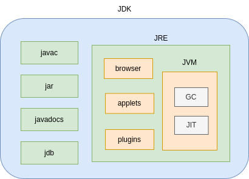
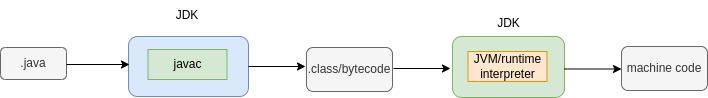
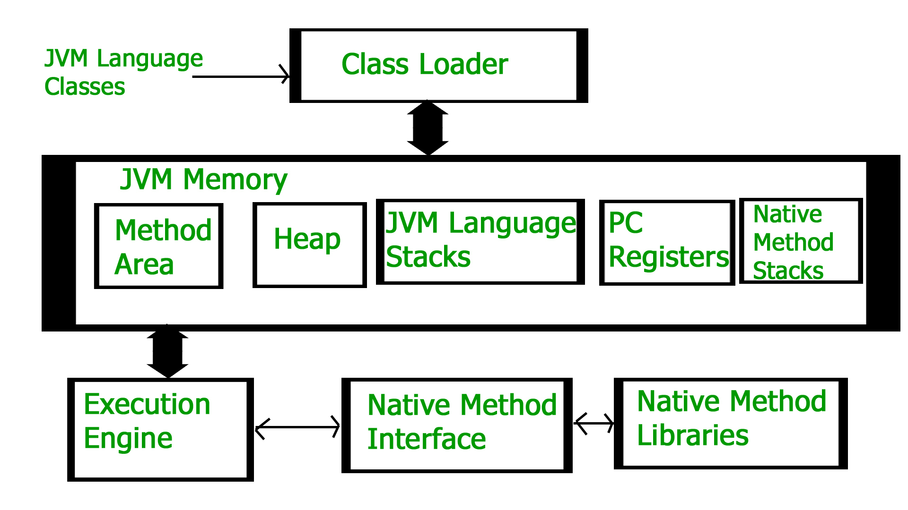
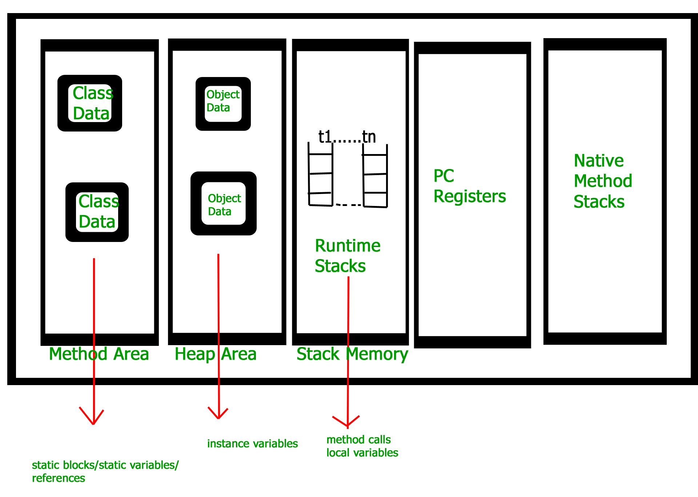

# JDK, JRE, and JVM Internals

## Overview
This note covers how Java code goes from source file to running program: the JDK/JRE/JVM relationship, the JVM's internal architecture, its memory areas, and garbage collection.

## JDK, JRE, and JVM
- **JDK (Java Development Kit)**: The full development kit — includes the JRE plus development tools like `javac` (compiler), `jar`, `javadocs`, and `jdb` (debugger).
- **JRE (Java Runtime Environment)**: Everything needed to *run* Java programs — includes the JVM plus supporting libraries (browser plugins, applets, etc.).
- **JVM (Java Virtual Machine)**: The engine that actually executes bytecode, including the Garbage Collector (GC) and Just-In-Time (JIT) compiler.



## Compilation and Execution Flow
1. `.java` source file is compiled by `javac` (part of the JDK) into `.class` bytecode.
2. The JVM's runtime interpreter executes the bytecode, producing machine code for the underlying platform.



## JVM Architecture
The JVM becomes an instance of the JRE at the runtime of a Java program. It is mainly responsible for three activities:
1. **Loading**: Performed by the **Class Loader**
2. **Linking**: Performs verification, preparation, and (optionally) resolution
3. **Initialization**: Initializes static variables and runs static blocks



### Execution Engine
Once classes are loaded into JVM memory, the Execution Engine runs the program. It has three parts:
- **Interpreter**: Executes bytecode line by line
- **Just-In-Time Compiler (JIT)**: Compiles frequently-used bytecode to native machine code for better performance
- **Garbage Collector (GC)**: Reclaims memory from unreferenced objects

## JVM Memory Areas
```
Class Loader ⇄ JVM Memory ⇄ Execution Engine ⇄ Native Method Interface ⇄ Native Method Libraries
```

JVM Memory is divided into:
- **Method Area**: Stores class-level data — static blocks, static variables, and references
- **Heap Area**: Stores object data — instance variables (shared across all threads)
- **Stack Memory**: One runtime stack per thread — stores method calls and local variables
- **PC Registers**: One per thread, tracks the address of the currently executing instruction
- **Native Method Stacks**: Supports native (non-Java) method calls



## Garbage Collection
- "Garbage" means unreferenced objects. An object becomes unreferenced by: nulling the reference, reassigning the reference to another object, or being an anonymous object with no reference at all.
- Garbage collection removes unreferenced objects from heap memory, freeing that memory for reuse.
- `protected void finalize() {}` is a method invoked each time just before an object is garbage collected (deprecated in modern Java in favor of `Cleaner`/try-with-resources, but still commonly asked about).

## Additional Information
- Static and transient fields relate to memory/serialization behavior — see [Serialization](../serialization/Serialization_README.md) for how `static`/`transient` interact with object persistence.
- JIT compilation is why long-running Java programs tend to speed up over time ("warm up").
