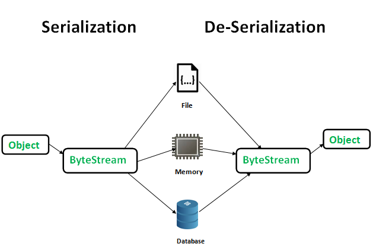

# Serialization, Marker Interfaces

## Overview
Serialization is the process of converting an object's state into a byte stream, so it can be persisted (to a file/database) or transmitted across a network. Deserialization reverses the process, reconstructing the object from the byte stream.



## Key Points
- The byte stream produced is platform-independent.
- Used to save/persist the state of an object, or to send an object across a network.
- To make a Java object serializable, implement the `java.io.Serializable` interface.
- `ObjectOutputStream.writeObject()` serializes an object; `ObjectInputStream.readObject()` deserializes it.
- **`static`** fields are **not** serialized — during deserialization they're loaded with the current value defined in the class (not the value at serialization time).
- **`transient`** fields are **not** serialized either — during deserialization they're initialized with their default value (e.g., `0`, `null`, `false`).

## Marker Interfaces
A **marker interface** is an empty interface (no fields or methods) used to "mark" a class so its instances gain a certain capability, checked via `instanceof` by the JVM/framework at runtime.

Examples: `Serializable`, `Cloneable`, `Remote`.

### Cloneable Example
```java
import java.lang.Cloneable;

// Implementing Cloneable marks instances of A as cloneable
class A implements Cloneable {
    int i;
    String s;

    public A(int i, String s) {
        this.i = i;
        this.s = s;
    }

    // Overriding clone() by delegating to Object's clone()
    @Override
    protected Object clone() throws CloneNotSupportedException {
        return super.clone();
    }
}

public class Test {
    public static void main(String[] args) throws CloneNotSupportedException {
        A a = new A(20, "GeeksForGeeks");
        // Down-casting since clone() returns Object
        A b = (A) a.clone();
        System.out.println(b.i);
        System.out.println(b.s);
    }
}
```

## Additional Information
- See [JVM Internals](../jvmInternals/JvmInternals_README.md) for how `static` fields relate to the Method Area, and how heap-allocated objects (relevant to serialization) fit into JVM memory.
